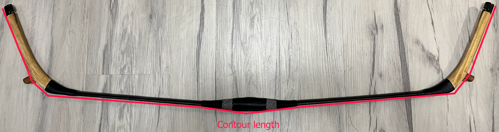

The unstrung contour length is a pretty simple measurement - you simply unstring the bow, then hold a measuring tape to one tip, and press it against the belly of the bow, slowly moving down along the contour of the belly until you reach the other tip. 

